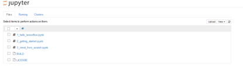

# TensorFlow 应用案例

## 安装

### Step 1：
登录 DataFoundry。如果你还没有账号，请点击注册。

### Step 2：
登录后的页面如下所示，点击“后端服务”，进行实例申请。

### Step 3：
创建 TensorFlow 服务的实例，输入服务名称后点击“创建”。

### Step 4：
在我的后端实例中找到 TensorFlow 实例，点击 Dashboard 图标，进入 jupyter notebook 进行实例编辑。

### Step 5:
进入后，你可以选择运行已有文件，或点击右上方“new”新建自己的文件。

## 示例
先从[参考示例](Tutorials/README.md)开始吧！