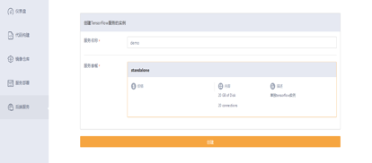
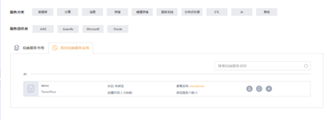
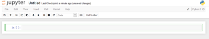

## 第一节：机器学习 - TensorFlow

### 1. 安装

#### Step 1：

登录 DataFoundry。如果你还没有账号，请点击注册。

#### Step 2：

登录后的页面如下所示，点击“后端服务”，进行实例申请。

#### Step 3：

创建 TensorFlow 服务的实例，输入服务名称后点击“创建”。

#### Step 4：

在我的后端实例中找到 TensorFlow 实例，点击 Dashboard 图标，进入 jupyter notebook 进行实例编辑。

#### Step 5:

进入后，你可以选择运行已有文件，或点击右上方“new”新建自己的文件。

### 2.示例

#### [Get_Started：用平面拟合三维数据](Get_Started.md)

本节从一段用 Python API 撰写的 TensorFlow 示例代码起步，让你对将要学习的内容有初步的印象。

#### [MNIST_Simple：MNIST 的简单实现](MNIST.md)

本节讲述一个经典的手写数字识别 (MNIST) 问题，并提供了简单实现。

#### [MNIST_CNN：MNIST 的卷积神经网络实现](MNIST.md)

卷积神经网络是为图像识别量身定做的一个模型，本节提供了 MNIST 的卷积神经网络实现。

#### [Word2Vec：单词的向量表示](Word2Vec.md)

本节让你了解为什么学会使用向量来表示单词， 是一件很有用的事情，所介绍的 Word2Vec 模型, 是一种高效学习嵌套的方法.

#### [PDE_Raindrop：运用偏微分方程模拟水滴落入水面的过程](PDE_Raindrop.md)

本节是一个非机器学习计算的例子，我们利用一个原生实现的偏微分方程，对雨滴落在池塘上的过程进行仿真.

