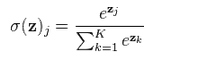
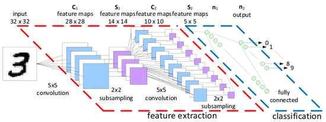

## MNIST：机器学习入门

MNIST 是一个入门级的计算机视觉数据集，它包含各种手写数字图片：

 

根据图像的像素信息列出可以代表图像的数字矩阵，从而进行运算：

 

将矩阵按一定顺序列成数组，如 28×28 的矩阵对应长度为 784 的数组向量。


### 下载数据
将数据分为训练集和测试集，其中训练集分为 images 和 labels 集：

- mnist.train.images 是一个形状为 [60000, 784] 的张量，第一个维度数字用来索引图片，第二个维度数字用来索引每张图片中的像素点。在此张量里的每一个元素，都表示某张图片里的某个像素的强度值，值介于 0 和 1 之间。


- 对应的 mnist.train.labels 是一个 [60000, 10] 的数字矩阵：


### 简单模型：mnist_simple

为判断该图像是否属于某数字，需要对图像的各像素进行加权求和：
- 如果这个像素具有很强的证据说明这张图片不属于该类，那么相应的权值为负数；
- 相反，如果这个像素拥有有利的证据支持这张图片属于这个类，那么权值是正数。

然后用 softmax 函数可以把这些加权的和转换成概率 y：




 
Tensorflow可以用代码简单地实现：

```
y = tf.nn.softmax(tf.matmul(x,W) + b)
```

对模型进行训练，用交叉熵进行判断评估：


y 是我们预测的概率分布, y' 是实际的分布。

TensorFlow 拥有一张描述你各个计算单元的图，它可以自动地使用反向传播算法来有效地确定你的变量是如何影响你想要最小化的那个成本值的。然后，TensorFlow 会用你选择的优化算法来不断地修改变量以降低成本。

此处采用了梯度下降法：

```
train_step = tf.train.GradientDescentOptimizer(0.01).minimize(cross_entropy)
```

### 复杂模型：mnist_cnn



为提高准确性，采用卷积和池化模型：

- 卷积：


对于图像，当从一个大尺寸图像中随机选取一小块，比如说 8×8 作为样本，并且从这个小块样本中学习到了一些特征，这时我们可以把从这个 8×8 样本中学习到的特征作为探测器，应用到这个图像的任意地方中去。卷积后得出卷积特征。

- 池化：


每幅图像经过卷积和池化处理之后，得到的特征的维数就会大幅度的降低。在代码中使用的是三色图，对应三个通道，对于每个通道都要分别进行卷积和池化，然后相加得到一个特征。选取多个卷积模板，得到不同的特征。

我们把池化层输出的张量 reshape 成一些向量，乘上权重矩阵，加上偏置，对其使用 ReLU（反向传输时的激活函数，在训练时会加快训练速度）。

最后进行 softmax 回归。

### 代码下载
- code: [mnist_simple.py](../Code/mnist_simple.py), [mnist_cnn.py](../Code/mnist_cnn.py)
- notebook: [mnist_simple.ipynb](../Notebook/mnist_simple.ipynb), [mnist_cnn.ipynb](../Notebook/mnist_cnn.ipynb)